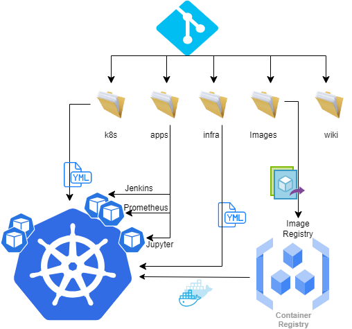

Dans cette partie nous trouvons toute la documentation du projet:
- Cadre du projet
- règle de fonctionement
- mise à jour
- incidents
- ...

ci dessous une première représentation de l'architecture applicatif et l'organisation du repo

# CADRE DU PROJET
Ce projet a était initié dans le cadre de la formation de la classe CVV3 de l'university Iteams Tunisia pour l'année 2024.
L'objectif est d'exploiter les compétances aquises dans les autres unités d'apprentissage (DevOps, Ansible, automatisation, ...)
et de les mettre en oeuvre dans un projet pratique.
vous trouver la présentation du projet dans ce docment

# Regle de fonctionnement
Pour garantir le bon fonctionnement et en appliquant quelques best practices, il était conveu que:
- la branche master est protegée et il ne peut pas y avoir aucun changement sauf à travers un merge de la branche develop.
- la branche develop est egalement pretégée et toute mise à jour passe par un merge des autres branches
- chaque contribiteur doit créer sa propre branche pour avancer sur ces travaux. Une fois fini il demande un merge request sur develop.
- chaque merge request est conditionné par minimum une validation d'une autre personne du projet.
- Pour faciliter la maintenance, les administrateurs du répo sont exenorés de ces règles. Mais il est recommander d'appliquer ces bonnes pratiques dans les travaux quotidien et ne les pas baypasser que pour des raison de maintenance ou résoluton d'incident.
